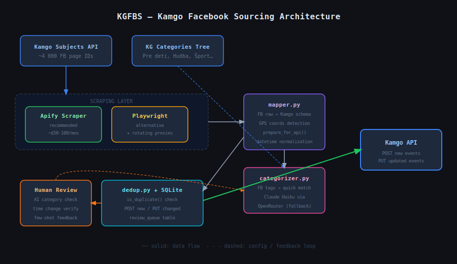

# KGFBS – Kamgo Facebook Sourcing (Proof of Concept)

> ⚠️ **Disclaimer:** Tento repozitár obsahuje proof-of-concept architektúru a ukážkový kód.
> Reálny scraping Facebooku vyžaduje platený scraping service (napr. Apify) kvôli anti-bot ochrane FB.
> Skript demonštruje logiku spracovania dát, mapovania na Event schému a odosielania do Kamgo API.

## Architektúra

```
[Kamgo Subjects API] → [Scraping Layer] → [Data Mapper] → [AI Kategorizer] → [Kamgo API]
```

### Scraping Layer (3 možnosti)
1. **Apify** (odporúčané) – spoľahlivé, ~$50-100/mes pre 4000 stránok
2. **Playwright + proxies** – lacnejšie (~$20-40/mes), vyžaduje údržbu
3. **Facebook Graph API** – oficiálne, ale veľmi obmedzené pre verejné eventy



## Spustenie

```bash
pip install requests python-dotenv
python main.py --mode mock    # ukážka s mock dátami
python main.py --mode live    # vyžaduje Apify API key
```

## Štruktúra
- `main.py` – hlavný skript
- `mapper.py` – mapovanie FB eventu na Kamgo Event schému  
- `categorizer.py` – AI kategorizácia cez OpenRouter/Claude
- `dedup.py` – logika detekcie duplikátov

---

## Porovnanie scraping prístupov

| | Apify | Playwright + Proxies | Facebook Graph API |
|---|---|---|---|
| **Cena** | ~$50-100/mes | ~$20-40/mes (proxies) | zadarmo |
| **Spoľahlivosť** | ✅ vysoká | ⚠️ stredná | ❌ nízka |
| **Údržba** | ✅ žiadna | ❌ pri každej zmene FB UI | ✅ žiadna |
| **Škálovanie** | ✅ ľahké | ⚠️ ťažké | ❌ rate limits |
| **Odporúčanie** | ✅ produkcia | PoC / nízky budget | ❌ nevhodné |

### Prečo nie Facebook Graph API?

FB Graph API bol kedysi ideálne riešenie, ale Meta ho postupne obmedzila:
- Verejné eventy sú dostupné iba ak má aplikácia špeciálne schválenie (`pages_read_engagement`)
- Schvaľovací proces trvá týždne a Meta ho často zamieta pre scraping účely
- Rate limits sú veľmi prísne pre 4000 stránok
- Mnohé polia (description, ticketUrl) nie sú dostupné bez pokročilých oprávnení

### Playwright ako alternatíva

Pozri `scraper_playwright.py` pre ukážku implementácie.
Hlavná nevýhoda: FB aktívne detekuje headless prehliadače a blokuje IP.
Riešenie vyžaduje rotating proxies a pravidelné aktualizácie pri zmene FB UI.
